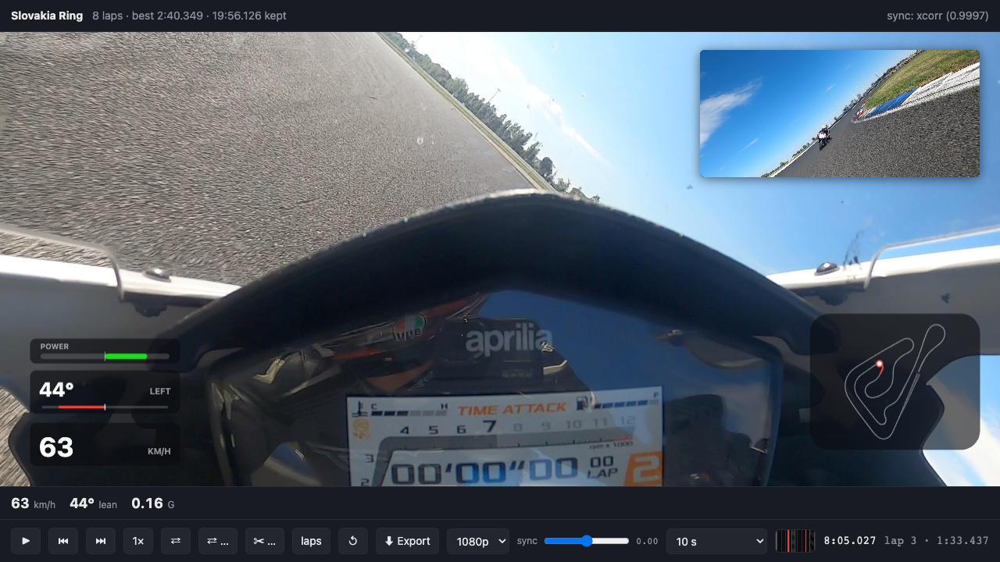

# track-overlay

[](https://github.com/Serdy/track-overlay/actions/workflows/ci.yml)

Burns telemetry from a **RaceBox** logger into onboard **GoPro** footage and composes a
finished MP4. Several cameras at once, picture-in-picture, swappable mid-session. Runs
locally — no cloud, no phone, no upload.



## Why

Putting telemetry onto track-day footage today means one of two things: a mobile app,
which is slow and gives you the layout it feels like giving you, or hand work in a video
editor, which is long and not repeatable. This does it in one pass, with a layout preset
you set up once and reuse for every session of the day.

## What it does

- Reads the **GPMF** telemetry stream GoPro embeds in the MP4 — satellite time, position,
  speed, fix quality
- Reads the **RaceBox** CSV and VBO exports at 25 Hz
- Aligns the two on one timeline, to better than a frame at 60 fps
- Finds the start/finish line and splits the session into laps, with no external track
  database
- Draws four widgets: speed, lean angle, acceleration/braking, and a map of the circuit
  built from your own GPS trace
- Composes any number of cameras with picture-in-picture, lets you swap them over a
  stretch, and cut the ride out and back off the ends
- Renders the lot into a single MP4 with hardware encoding

## How it works

The browser draws and shows, ffmpeg splices.

```
RaceBox CSV ──┐
              ├──→ sync ──→ session.json ──┐
GoPro MP4/LRV ┘        (one timeline)       │
                                            ▼
                                   ┌─────────────────┐
                                   │   web editor    │  preview, layout,
                                   │   (browser)     │  switches, trimming
                                   └────────┬────────┘
                                            │
                            layout.json + overlay.webm
                                            │
     full-resolution source MP4s ───────────┴──→ ffmpeg ──→ out.mp4
```

Three decisions shape everything else:

**The preview plays through `<video>` tags.** The expensive half of an editor — decoding
and scrubbing several streams in step — comes free from the browser. Playback uses
GoPro's own `.LRV` proxies, so scrubbing stays responsive on 4K footage.

**The overlay is drawn once, by one piece of code.** The same canvas routine feeds the
preview and the exporter, so the two cannot drift apart. Every position in the layout is
a fraction of the frame, never a pixel — that is what lets a preview on a window of
whatever size and a render at full resolution produce the same picture.

**Only ffmpeg touches the heavy video.** The browser encodes a small, mostly empty
overlay layer. That is why the GoPro codec never matters and why the whole thing is
quick.

## Requirements

- ffmpeg 7 or newer (`ffprobe` too — it ships alongside)
- Python 3.12, managed through [uv](https://docs.astral.sh/uv/)
- A browser with WebCodecs: Chrome, Edge or a recent Safari
- macOS gets hardware encoding through VideoToolbox; elsewhere change `VIDEO_CODEC` in
  `src/trackoverlay/render.py`

## Getting started

```bash
uv sync
```

### 1. Put the files somewhere

Copy the GoPro files and the RaceBox export into `data/`. Chunks of one recording
(`GH013429.MP4`, `GH023429.MP4`, …) all belong there — they are joined automatically.

RaceBox exports twice, because its **Bike Mode** setting replaces lateral acceleration
with lean angle rather than adding it. Export the session both ways and keep both files;
`merge` folds them into one set of channels. The VBO is optional — it carries a `heading`
column the CSV lacks, which makes the lean angle slightly cleaner.

If the GoPro clock has drifted and the file dates are nonsense, fix them from satellite
time:

```bash
uv run python tools/gopro_dates.py --apply data/*.MP4
```

### 2. Build the session

```bash
uv run trackoverlay build data/*.csv data/*.vbo data/GH*.MP4 \
    --track "Slovakia Ring" -o out/session.json
```

```
session: 25.0 Hz, 40420 samples, 8 laps, best 2:40.349
  ✓ cam_3429: starts -116.14 s, 28.9 min, sync xcorr (corr 0.9997)
  ✓ cam_3446: starts -115.26 s, 11.8 min, sync xcorr (corr 0.9976)
written: out/session.json
```

The tick means the video was aligned by correlating its own GPS speed against the
logger's. A `!` means it fell back to UTC alone or to manual adjustment — which happens
when the camera never caught satellites, and is still workable with the sync slider.

### 3. Arrange and export

```bash
uv run trackoverlay serve out/session.json
```

| Action | How |
| :--- | :--- |
| Play / pause | Space |
| Step one frame | ← → (Shift for ten) |
| Jump between laps | ↑ ↓ |
| Move a widget or the inset | drag it |
| Resize one | wheel over it |
| Swap the cameras from here | `⇄` or S |
| Swap them over a stretch | `⇄ …` or D, twice: start then end |
| Cut a stretch out | `✂ …` or X, twice |
| Trim to the timed laps | `laps` |
| Undo all of it | `↺` |
| Shift telemetry against video | the `sync` slider |

Everything is saved to `out/layout.json` as you go, and reloaded next time.

Press **Export** to compose. Start with the 10-second option to check the layout before
committing to a full session. The same thing from a terminal:

```bash
uv run trackoverlay render out/session.json out/layout.json \
    --overlay out/overlay.webm -o out/final.mp4
```

## Tools

```bash
# Recover the real recording time from GPS and repair the file dates.
uv run python tools/gopro_dates.py --apply data/*.MP4

# Show how video and telemetry line up, and whether the offset drifts.
uv run python tools/sync_check.py data/*.csv data/GH*.MP4
```

```
telemetry: 40419 rows, 25.0 Hz, start 12.09 12:31:30 UTC

recording 3429: method xcorr correction -1.36s corr 0.9997 overlap 26.9min
    across 8 windows: median -1.36s, 8 within 0.1s, worst deviation 0.02s
```

## Two things that were harder than they look

**Synchronisation.** Both devices write UTC, so a coarse alignment is free — but it is
not enough. On the session in `data/` the correlation peak sits 1.4 s away from where UTC
puts it, and 1.4 s is 84 frames at 60 fps. The offset itself is rock steady across 27
minutes, so no drift compensation is needed; what is needed is sub-sample refinement of
the correlation peak, because a 10 Hz search grid only resolves to 6 frames. The offset
is taken as a median across windows, since a stretch of unreliable GPS speed — pulling
away from a standstill on a fresh fix — otherwise drags the whole estimate.

**Transparency.** WebCodecs advertises an `alpha: 'keep'` option that no browser tested
here will actually encode; VP9, VP8, H.264 and AV1 all report support only with alpha
off. So the overlay is written as a frame of double height, colour on top and a greyscale
matte below, and ffmpeg puts them back together with `alphamerge`. One encode and one
file, so the halves cannot drift apart.

## Tests

```bash
uv run pytest && node --test web/test/*.test.js
```

Tests that need the source video skip themselves when it is absent. The MP4s are far too
large for a repository, but the RaceBox exports are not — so most of the suite, including
lap detection against real data from a real track day, runs anywhere.

JavaScript tests are launched through a glob rather than a directory: node 22 and later
try to load `web/test/` as a module.

## Layout

```
src/trackoverlay/
  ingest/gpmf.py      KLV parsing of the GPMF stream
  ingest/clips.py     grouping GoPro chunks, checking the joints
  ingest/racebox.py   the CSV and VBO exports
  telemetry.py        channels and the quantities derived from them
  sync.py             UTC, then cross-correlation, then a manual slider
  laps.py             gates, laps, and the envelope of trajectories
  session.py          assembling session.json
  render.py           the ffmpeg filter graph
  server.py           range requests, and launching renders
web/
  js/clock.js         the single source of the current time
  js/session.js       the session model and channel sampling
  js/cuts.js          which camera is in which slot, and when that changes
  js/ranges.js        which parts of the session reach the video
  js/display.js       turning noisy channels into numbers that hold still
  js/widgets/         speed, lean, acceleration, map
  js/export_overlay.js  the telemetry layer, through WebCodecs
```

## Credits

The acceleration and braking score comes from
[serious-racing](https://github.com/Serdy/serious-racing) — `sr-track.js` was carried over
whole, with its constants rescaled from 10 Hz to 25 Hz. Some of the parsing approach and
the gate detection follow an earlier project of mine,
[DDA_Reader](https://github.com/slowfastguy/DDA_Reader), which does the same job for
Ducati's own logger.

## License

MIT — see [LICENSE](LICENSE).
